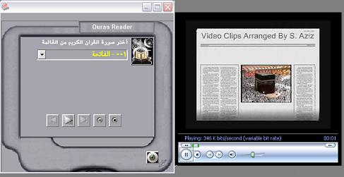



## Holy Quran

### Description

Holy Quran is a complete application to listen Quran chapters on computers.

The application uses MCI control without using its default buttons to play/pause/stop. Instead it uses the command button and send commands to MCI control for these purpose.

Secondly,it shows the use of Windows Media control to display .dat video file.

In addition to above you will find the slider control to show the progress of current chapter alongwith Time elapsed and Total Time. Also volume control has been used to increase/decrease volume from the application itself.
 
### More Info
 

             |
---                |---
**Submitted On**   |2009-08-08 15:22:12
**By**             |[Sayed Aziz](https://github.com/Planet-Source-Code/PSCIndex/blob/master/ByAuthor/sayed-aziz.md)
**Level**          |Advanced
**User Rating**    |4.0 (52 globes from 13 users)
**Compatibility**  |VB 6\.0
**Category**       |[Complete Applications](https://github.com/Planet-Source-Code/PSCIndex/blob/master/ByCategory/complete-applications__1-27.md)
**World**          |[Visual Basic](https://github.com/Planet-Source-Code/PSCIndex/blob/master/ByWorld/visual-basic.md)
**Archive File**   |[Holy\_Quran215951892009\.zip](https://github.com/Planet-Source-Code/sayed-aziz-holy-quran__1-72343/archive/master.zip)

